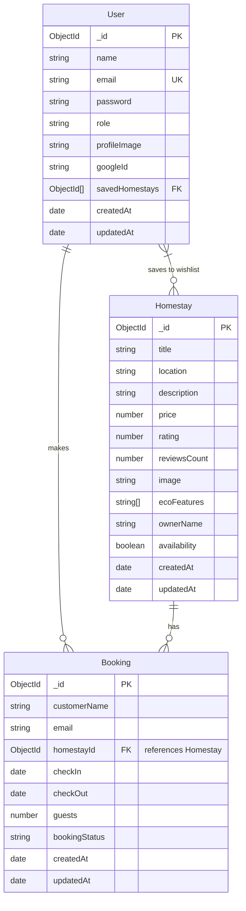

# 🌿 EcoStay Connect – Full Stack Eco-Tourism & Homestay Platform

[](https://github.com/)
[](https://nodejs.org/)
[](https://react.dev/)
[](https://tailwindcss.com/)
[](https://www.mongodb.com/atlas)
[](https://deepmind.google/technologies/gemini/)

**EcoStay Connect** is a production-grade full-stack web application designed for discovering, booking, and managing sustainable, carbon-audited eco homestays in rural and mountain regions. It features complete JWT authentication, Google OAuth 2.0 integration, a Google Gemini-powered AI Eco Travel Assistant, an interactive authenticated dashboard, full CRUD APIs, and responsive design.

---

## ✨ Features Highlight

### 🛡️ Authentication & Security (Week 6)
- **User Authentication**: User Registration, Login, and Logout.
- **Password Security**: Passwords hashed with `bcrypt.js` (10 salt rounds); plain passwords are never stored or exposed in API responses.
- **JWT Protection**: Secure JSON Web Tokens (7-day expiry) protecting Booking, User Profile, Dashboard, and AI endpoints.
- **Google OAuth 2.0**: One-click sign-in via Passport.js Google Strategy.
- **Input Validation**: Robust request payload validation using `express-validator`.
- **Rate Limiting**: `express-rate-limit` enforcing a maximum of 5 auth requests per 15-minute window to prevent brute force attacks.

### 🤖 AI API Integration (Week 7)
- **Eco Travel AI Assistant**: Powered by **Google Gemini 1.5 Flash API**.
- **Capabilities**: Custom 3-day green itineraries, zero-waste packing tips, carbon reduction advice, and homestay recommendations.
- **Frontend AI Interface**: Interactive chat window with Markdown output (`react-markdown`), one-click preset prompt chips, copy response button, auto-scroll, clear chat confirmation modal, and intelligent fallback engine for 100% availability.

### 🖥️ Frontend Completion & Polish (Week 8)
- **Authenticated User Dashboard**: Real-time display of user profile details, active reservations, saved favorite homestays, and quick controls.
- **Complete CRUD Operations**: Onboard homestays, book stays, update profile credentials, and cancel bookings with live backend API integration.
- **UI Components**:
  - `ErrorBoundary`: Catches JavaScript rendering errors gracefully without blank screens.
  - `EmptyState`: Visually rich empty states for missing bookings, homestays, or AI history.
  - `ConfirmModal`: Reusable modal for destructive user actions.
  - `Toast`: Dynamic success, warning, and error toast alerts.
- **Fully Responsive**: Optimized for Mobile (375px), Tablet (768px), and Desktop (1440px) screen sizes.

---

## 🛠️ Technology Stack

| Layer | Technology |
|---|---|
| **Frontend** | React 19, Vite, Tailwind CSS v4, Lucide Icons, React Markdown |
| **Backend** | Node.js, Express.js, MVC Architecture |
| **Database** | MongoDB Atlas, Mongoose ODM |
| **Authentication** | JWT (jsonwebtoken), bcryptjs, Passport.js (Google OAuth 2.0) |
| **Security** | express-validator, express-rate-limit, CORS |
| **AI Integration**| Google Gemini 1.5 Flash API (`@google/generative-ai`) |

---

## 📁 Repository Directory Structure

```text
EcoStayConnect/
├── PROMPTS.md                         # AI Prompt Engineering Documentation
├── README.md                          # Main GitHub Repository Guide
├── package.json                       # Frontend Vite dependencies
├── src/                               # Frontend React Source Code
│   ├── components/
│   │   ├── ErrorBoundary.jsx          # React Error Boundary
│   │   ├── Footer.jsx                 # Global Footer
│   │   ├── Hero.jsx                   # Hero Banner
│   │   ├── Navbar.jsx                 # Responsive Glassmorphism Navigation
│   │   ├── ProtectedRoute.jsx         # Auth Route Guard
│   │   └── ui/                        # Reusable Component Library
│   │       ├── Button.jsx
│   │       ├── Card.jsx
│   │       ├── ConfirmModal.jsx       # Delete Confirmation Dialog
│   │       ├── EmptyState.jsx         # Empty state visuals
│   │       ├── Input.jsx
│   │       ├── Loader.jsx
│   │       ├── Modal.jsx
│   │       └── Toast.jsx
│   ├── context/
│   │   ├── AuthContext.jsx            # Authentication Context & State
│   │   └── ThemeContext.jsx           # Dark / Light Mode Context
│   ├── pages/
│   │   ├── AIAssistant.jsx            # AI Chat Assistant Page
│   │   ├── About.jsx                  # Eco Mission Page
│   │   ├── ComponentShowcase.jsx      # UI Showcase
│   │   ├── Dashboard.jsx              # Authenticated User Dashboard
│   │   ├── Home.jsx                   # Property Discovery & Filtering
│   │   ├── Login.jsx                  # Sign In Page with Google OAuth
│   │   ├── Profile.jsx                # User Profile Management
│   │   └── Register.jsx               # Sign Up Page
│   └── services/
│       └── api.js                     # Centralized Fetch API Client
└── backend/                           # Express.js REST API Backend
    ├── .env.example                   # Environment Template
    ├── config/
    │   ├── db.js                      # MongoDB Atlas Connection
    │   └── passport.js                # Google OAuth Strategy Config
    ├── controllers/
    │   ├── aiController.js            # Gemini AI Integration
    │   ├── bookingController.js       # Booking CRUD Logic
    │   ├── homestayController.js      # Property CRUD & Search Logic
    │   └── userController.js          # Authentication & Profile Logic
    ├── middleware/
    │   ├── authMiddleware.js          # JWT & Role Authorization
    │   ├── errorMiddleware.js         # 404 & Global Error Middleware
    │   ├── rateLimiter.js             # 5 req/15 min Rate Limiter
    │   └── validators.js              # Express Validator Middleware
    ├── models/
    │   ├── bookingModel.js            # Booking Mongoose Schema
    │   ├── homestayModel.js           # Homestay Mongoose Schema
    │   └── userModel.js               # User Mongoose Schema
    ├── routes/
    │   ├── aiRoutes.js                # AI API Endpoints
    │   ├── bookingRoutes.js           # Booking API Endpoints
    │   ├── homestayRoutes.js          # Homestay API Endpoints
    │   └── userRoutes.js             # Auth & User API Endpoints
    ├── utils/
    │   ├── asyncHandler.js            # Async Exception Handler
    │   └── seeder.js                  # Database Seeder Script
    └── server.js                      # Main Server Entry Point
```

---

## ⚡ REST API Endpoint Reference

| Route | Method | Access | Description |
|---|---|---|---|
| **`/api/users/register`** | **POST** | Public | Register new user (Rate limited, returns JWT) |
| **`/api/users/login`** | **POST** | Public | Login user (Rate limited, returns JWT) |
| **`/api/users/google`** | **GET** | Public | Initiate Google OAuth 2.0 flow |
| **`/api/users/profile`** | **GET** | Private | Fetch logged-in user profile |
| **`/api/users/profile`** | **PUT** | Private | Update user credentials & avatar |
| **`/api/users/saved-homestays/:id`** | **POST** | Private | Toggle homestay in user wishlist |
| **`/api/homestays`** | **GET** | Public | Retrieve all eco homestays |
| **`/api/homestays/search`** | **GET** | Public | Search homestays by location (`?location=Manali`) |
| **`/api/homestays/filter`** | **GET** | Public | Filter homestays by rating (`?rating=4.5`) |
| **`/api/homestays`** | **POST** | Private | Onboard a new homestay listing |
| **`/api/homestays/:id`** | **DELETE**| Private | Delete a homestay listing |
| **`/api/bookings`** | **GET** | Private | Fetch active user bookings |
| **`/api/bookings`** | **POST** | Private | Create a new homestay reservation |
| **`/api/bookings/:id`** | **DELETE**| Private | Cancel a booking |
| **`/api/ai/chat`** | **POST** | Private | Process prompt via Google Gemini AI Engine |

---

## 🚀 Local Installation & Setup Guide

### 1. Clone the Repository
```bash
git clone https://github.com/your-username/EcoStayConnect.git
cd EcoStayConnect
```

---

### 2. Backend Setup

1. Navigate to the `backend` folder:
   ```bash
   cd backend
   ```
2. Install Node dependencies:
   ```bash
   npm install
   ```
3. Create your `.env` configuration file:
   ```bash
   cp .env.example .env
   ```
4. Fill in your credentials inside `backend/.env`:
   ```env
   PORT=5000
   MONGODB_URI=mongodb+srv://<username>:<password>@cluster.mongodb.net/ecostay_connect?retryWrites=true&w=majority
   NODE_ENV=development
   JWT_SECRET=ecostay_jwt_secret_key_2026
   GEMINI_API_KEY=your_google_gemini_api_key_here
   GOOGLE_CLIENT_ID=your_google_client_id
   GOOGLE_CLIENT_SECRET=your_google_client_secret
   CLIENT_URL=http://localhost:5173
   ```
5. Seed the database with sample users and homestays:
   ```bash
   npm run seed
   ```
6. Start the backend API server:
   ```bash
   npm run dev
   ```
   > 🟢 Backend running at: **`http://localhost:5000`**

---

### 3. Frontend Setup

1. Open a new terminal in the project root directory:
   ```bash
   cd EcoStayConnect
   ```
2. Install dependencies:
   ```bash
   npm install
   ```
3. Start the Vite development server:
   ```bash
   npm run dev
   ```
   > 🌐 Frontend app running at: **`http://localhost:5173`**

---

## 🔑 Demo Account Credentials

Use these pre-seeded accounts to explore authenticated features immediately, or click **"Autofill Demo"** on the Login page:

| Account Type | Email | Password |
|---|---|---|
| **Traveler (Customer)** | `traveler@ecostay.org` | `password123` |
| **Admin User** | `admin@ecostay.com` | `adminpassword` |

---

## 📊 Database Schema & ER Diagram



---

## 📄 License
This project is open-source and available under the [MIT License](LICENSE).
